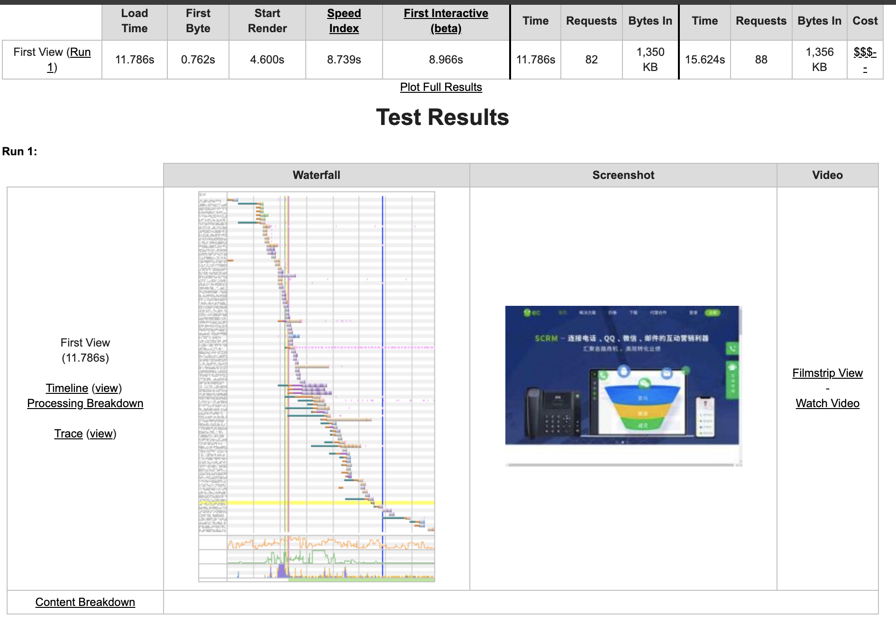
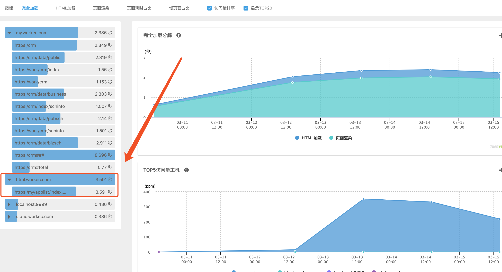
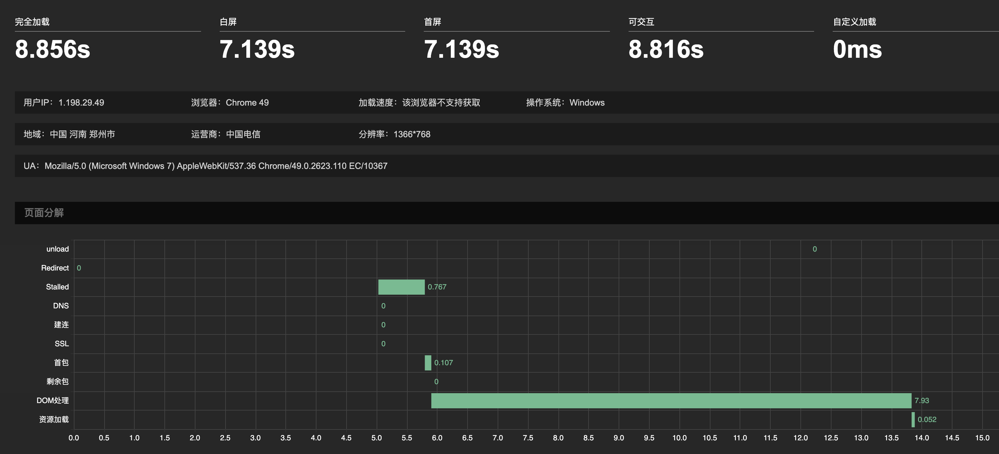
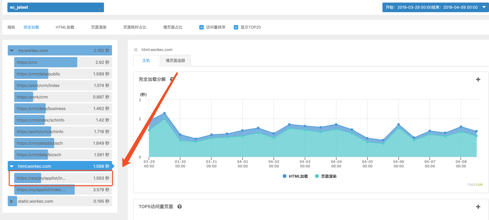
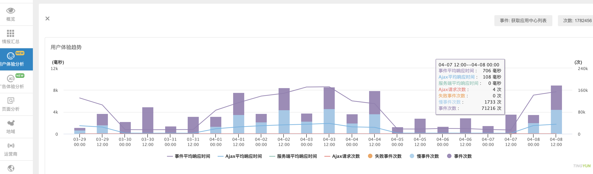

# 性能监控

## 目的

针对我方 Web 前端页面性能优化点进行的调研和统计报告，意图为提升用户最终整体交互体验。

该统计调研报告包含发现并提取关键性性能指标并试图做有意义的量化，指标项覆盖用户体验痛点场景。

最终针对场景和优化点进行问题解决。

## 参考资料

### 指标定义和影响

首先搜集关键性指标的定义。

[W3C 对 navigation-timing 的指标定义](https://www.w3.org/TR/navigation-timing/#performancenavigation)

[html5rocks 对 timing 的详细实用描述](https://www.html5rocks.com/en/tutorials/webperformance/basics/?redirect_from_locale=zh)

[网页打开性能与 SEO 的直接影响 - 调研文](https://www.webpronews.com/how-page-load-speed-impacts-seo-and-user-experience/)

### 第三方参考资料

然后结合已有的第三方资料观察已有可利用的经验，并梳理切合我方的调研方向。

[打造监控平台](http://fex.baidu.com/blog/2014/05/build-performance-monitor-in-7-days/)

[performance 使用](http://www.alloyteam.com/2015/09/explore-performance/)

[实现前端监控工具](https://juejin.im/post/5b7a50c0e51d4538af60d995)

为较为清晰的提取指标，提供一张在请求发出的整个过程中，各环节的时间顺序示意图。


## 用户体验量化点

经过对关键性指标的调研后，我方试图寻找影响最大的用户体验量化点，即为用户痛点。

- 白屏时间
  主要因素：首字节时间和头部资源加载时间

- 首屏时间
  建议减少非首屏使用的 css 及 JS，尽快让首屏呈现
  
  > 首屏位置调用 API 开始统计 -> 绑定首屏内所有图片的 load 事件 -> 页面加载完后判断图片是否在首屏内，找出加载最慢的一张 -> 首屏时间

## 实现方案和意图

监控工具优先考虑持续监控的开源项目自建选择，以便于完全可控的监控企业内部目标。

我们不完全依赖__线上工具__做检测有如下原因。

- 无法确切得知用户数
- 无法大量采样数据标本
- 无法监控复杂应用与细分功能

但这并不妨碍我们使用线上工具辅助我们做大维度下的关键优化点排查和定位。

### 线上工具

- [线上网页性能分析工具 - gtmetrix](https://gtmetrix.com/)

- [Google 的 Page Speed 性能分析工具](https://developers.google.com/speed/pagespeed/insights/)

- [Lighthouse Github 地址](https://github.com/GoogleChrome/lighthouse)

### 自建工具

自行搭建的开源监控工具往往更加可控，而且方便定制，可以作为未来我方内部监控平台的选择方案。

- [性能分析工具  WebPagetest](https://github.com/WPO-Foundation/webpagetest)（开源项目，支持企业自定义搭建）

  [WebPagetest 线上版本](https://www.webpagetest.org/)
    
- [新浪研发的 berserkJS Github 地址](https://github.com/tapir-dream/berserkJS)（支持命令行 JavaScript 脚本调用）

### 测量实验

以下截图只提供第一次运行的性能检测，详细内容可以通过 [WebPagetest 针对 EC 官网进行的桌面测试结果](https://www.webpagetest.org/result/190227_ZV_3a579e5e1145d18880d4cda9bcc4f4f8/) 查看。



通过线上工具检测我们可以在较粗糙的纬度下得出结论，我方官网可交互时间滞后的原因较大影响点来源于资源的加载过慢。

### 第三方统计测量

通过线上工具我们不能做到搜集细纬度覆盖到的通用场景交互信息，因此我方借助听云 SDK 试图发现典型页面的已存性能问题。

这里我们提供应用中心和 CRM 客户端内客户列表两个较频繁交互页面的完全加载指标进行检测，这里以应用中心为例，我们发现资源的加载项已经较为直观的影响到了用户的可交互时间，并延长了白屏时间的出现。



通过进一步的审查，我们发现前端在获取到资源后的本地解析在部分用户交互中占用了较长时间。



这意味着我方本地渲染 html 模板的时间过长，通过对时间片的分析，定位到问题来源于整块页面资源 antd 和 css 的加载导致，而且在拉取到远端资源后，本地并没有做影响用户视觉体验的鱼骨图占位交互，综合考量下，我方针对已存在的问题对应用中心进行迁移。

迁移后的加载平均时间变化。



通过开启听云的单页面定制事件统计，我方进一步发现接口拉取的时间影响，虽然相比于资源加载对用户体验影响较小，但依然可以通过本地缓存的办法进一步加快白屏消失的时间，提前获取到应用中心的列表数据。



通过细纬度统计我方发现，虽然听云依然不能做到完全监控动态加载和影响用户直接交互的精确时间点，但是相比于线上工具可以进一步帮助我方定位到用户频繁交互的页面场景，让我方可以针对较大范围用户量交互的页面进行优先级次序安排优化点。

## 代码实现量化指标

在尝试了听云第三方监控后，我方意识到，最终发掘有价值的用户交互关键时间点指标项和现存的前端代码逻辑息息相关，不存在可以直接暴露业务性能交互痛点的银色子弹。

这意味着我们需要自己完全可控的监控平台和纬度提取策略，才能结合前端代码逻辑自行埋点查找到影响用户交互的真正业务痛点，方能使得我方的优化方向走的更具有意义。

下方提供出从代码实现纬度可提取的所有有意义的关键指标，为我方后期做统计上报做预先的准备工作。

```
// 计算加载时间
function getPerformanceTiming () {  
    var performance = window.performance;
 
    if (!performance) {
        // 当前浏览器不支持
        console.log('你的浏览器不支持 performance 接口');
        return;
    }
 
    var t = performance.timing;
    var times = {};
 
    //【重要】页面加载完成的时间
    //【原因】这几乎代表了用户等待页面可用的时间
    times.loadPage = t.loadEventEnd - t.navigationStart;
 
    //【重要】解析 DOM 树结构的时间
    //【原因】DOM 树嵌套是不是太多
    times.domReady = t.domComplete - t.responseEnd;
 
    //【重要】重定向的时间
    //【原因】拒绝重定向时间。比如，http://example.com/ 就不该写成 http://example.com
    times.redirect = t.redirectEnd - t.redirectStart;
 
    //【重要】DNS 查询时间
    //【原因】DNS 是否预加载。页面内是不是使用了太多不同的域名导致域名查询的时间太长？
    // 可使用 HTML5 Prefetch 预查询 DNS ，见：[HTML5 prefetch](http://segmentfault.com/a/1190000000633364)            
    times.lookupDomain = t.domainLookupEnd - t.domainLookupStart;
 
    //【重要】读取页面第一个字节的时间
    //【原因】这可以理解为用户拿到你的资源占用的时间，是否已经做到了加异地机房、加 CDN 处理了、加带宽或加 CPU 运算速度
    // TTFB 即 Time To First Byte 的意思
    // 维基百科：https://en.wikipedia.org/wiki/Time_To_First_Byte
    times.ttfb = t.responseStart - t.navigationStart;
 
    //【重要】内容加载完成的时间
    //【原因】页面内容经过 gzip 压缩了么，静态资源 css/js 等压缩了么？
    times.request = t.responseEnd - t.requestStart;
 
    //【重要】执行 onload 回调函数的时间
    //【原因】是否太多不必要的操作都放到 onload 回调函数里执行了，考虑过延迟加载、按需加载的策略么？
    times.loadEvent = t.loadEventEnd - t.loadEventStart;
 
    // DNS 缓存时间
    times.appcache = t.domainLookupStart - t.fetchStart;
 
    // 卸载页面的时间
    times.unloadEvent = t.unloadEventEnd - t.unloadEventStart;
 
    // TCP 建立连接完成握手的时间
    times.connect = t.connectEnd - t.connectStart;
 
    return times;
}
```