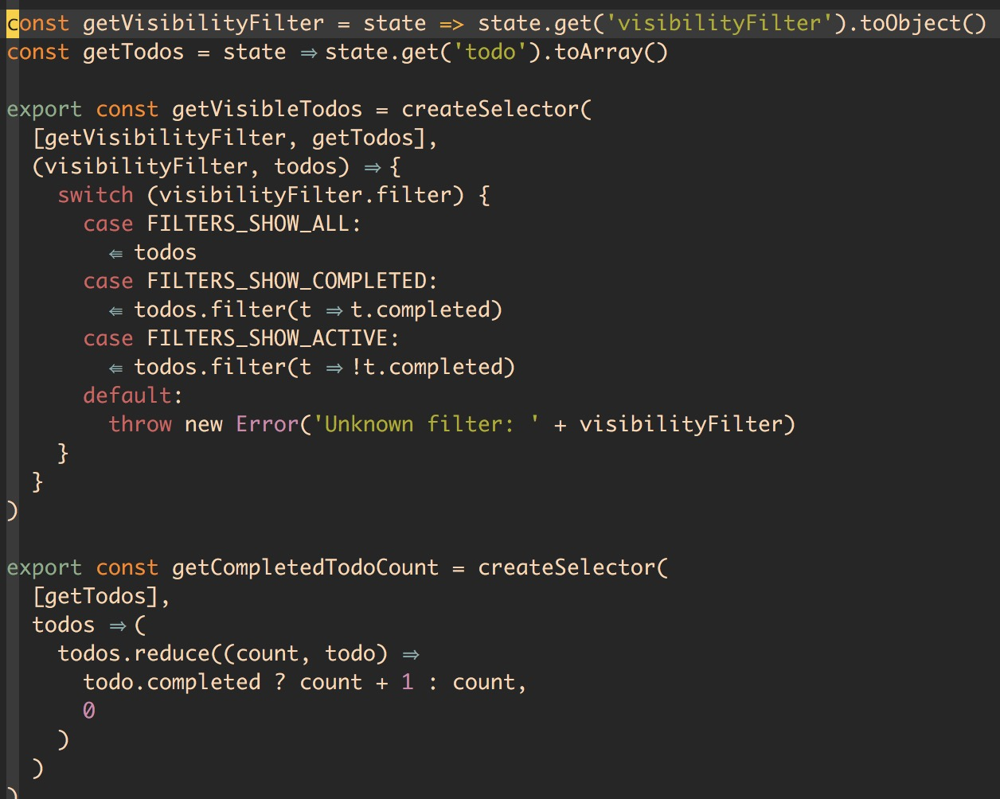

# 场景优化

除开本例中对 state 本身的结构优化，在更接近一般性的场景中，我们会遇到前端计算和网络请求的开销问题。

而本结构在 web 环境中考量这些场景的长远意义在于，如果我们将这套环境迁移至 React Native 实现的应用中，内存的使用和渲染的优化变得会更加重要。

## Reselect

我们有时候会意图在内存中驻守某个需要计算开销的结果，不需要每次都经过重复的前端计算得到不变的值。

[reduxjs/reselect](https://github.com/reduxjs/reselect) 可以从 state 中选取我们需要的相关变量并组建计算，并缓存结果，再下一次结果真正发生变化的时候才会更新值，如果未变化则从内存中直接获取。

备选方案 [Re-reselect](https://github.com/toomuchdesign/re-reselect) 解决了 Reselect 在改变参数调用获取前次结果的内存失效问题，Re-reselect 通过 cacheKey 能够获取到准确的对应结果。

关于 cacheKey 的设计原理参考 [toomuchdesign/re-reselect#How do I use multiple inputs to set the cacheKey?](https://github.com/toomuchdesign/re-reselect#how-do-i-use-multiple-inputs-to-set-the-cachekey)。

## HTTP

本示例基于 [axios](https://github.com/axios/axios) 封装了一套可以简单发送 http request 的上层行为，支持 拦截器 和 cancel request 操作，可以配合 saga 调用。