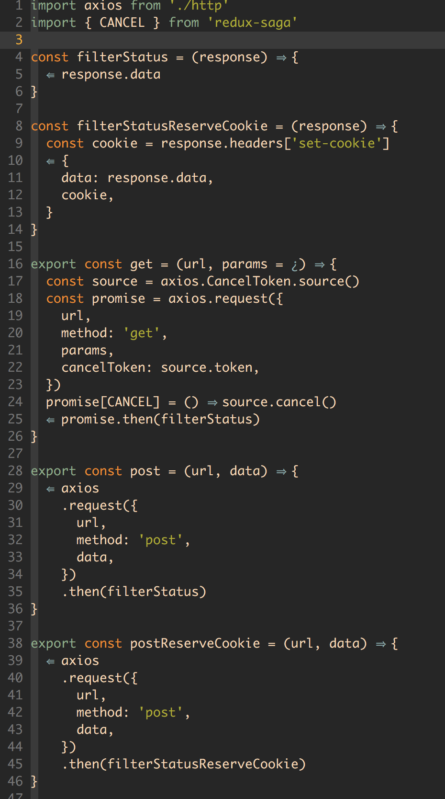
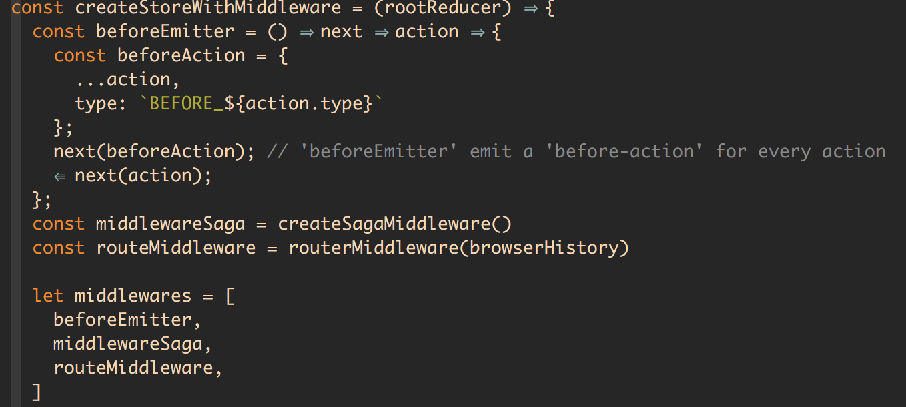
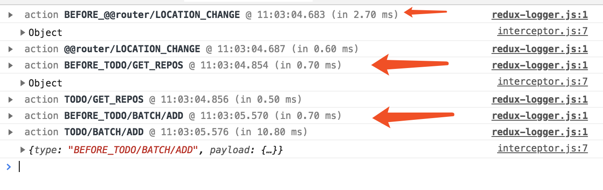

# 场景优化

除开本例中对 state 本身的结构优化，在更接近一般性的场景中，我们会遇到前端计算和网络请求的开销问题。

而本结构在 web 环境中考量这些场景的长远意义在于，如果我们将这套环境迁移至 React Native 实现的应用中，内存的使用和渲染的优化变得会更加重要。

## Reselect

我们有时候会意图在内存中驻守某个需要计算开销的结果，不需要每次都经过重复的前端计算得到不变的值。

[reduxjs/reselect](https://github.com/reduxjs/reselect) 可以从 state 中选取我们需要的相关变量并组建计算，并缓存结果，再下一次结果真正发生变化的时候才会更新值，如果未变化则从内存中直接获取。


备选方案 [Re-reselect](https://github.com/toomuchdesign/re-reselect) 解决了 Reselect 在改变参数调用获取前次结果的内存失效问题，Re-reselect 通过 cacheKey 能够获取到准确的对应结果。

关于 cacheKey 的设计原理参考 [toomuchdesign/re-reselect#How do I use multiple inputs to set the cacheKey?](https://github.com/toomuchdesign/re-reselect#how-do-i-use-multiple-inputs-to-set-the-cachekey)。

## HTTP

关于网络层的底层封装，我们有数种选择，其中 ES6 [Fetch API](https://developer.mozilla.org/en-US/docs/Web/API/Fetch_API) 基于 Promise 实现了以 data flow chain 的方式同步调用写法，但这里并不建议使用该接口的原因如下。

1. 如何 abort fetch 仍是[存在问题的争论](https://github.com/whatwg/fetch/issues/27)


  在一些场景中，我们需要确实的 `cancel` 前次请求，而基于 Promise 的 api 是无法从外部改变内部状态的，目前的解决办法只是拿到请求结果后 `reject` 掉，但此过程中依然发送了网络请求。
  
2. 需自行定制内部的 timeout

  Fetch API 本身不实现上层的逻辑，我们依然需要定制部分业务场景下 [timeout 的实现](https://github.com/github/fetch/issues/175)
  
  ```
  function timeoutPromise(ms, promise) {
    return new Promise((resolve, reject) => {
      const timeoutId = setTimeout(() => {
        reject(new Error("promise timeout"))
      }, ms);
      promise.then(
        (res) => {
          clearTimeout(timeoutId);
          resolve(res);
        },
        (err) => {
          clearTimeout(timeoutId);
          reject(err);
        }
      );
    })
  }
  ```

基于上述原因，我们选用更加成熟的上层封装功能库帮助我们实现 HTTP 的交互。

本示例基于 [axios](https://github.com/axios/axios) 封装了一套可以简单发送 http request 的上层行为，支持 拦截器 和 cancel request 操作，可以[配合 saga 调用](https://github.com/redux-saga/redux-saga/issues/701)。



## 自定义中间件

结合 redux [关于 middleware 的原理设计](https://redux.js.org/advanced/middleware)，在某些场景下，我们需要一个全局的中间件机制帮助我们处理每一次 action 派发到 reducer 前的操作。

本例中我们配合 redux-saga 实现定制的中间件，可以在每次 action 前被触发。



控制台最终的执行效果如下

