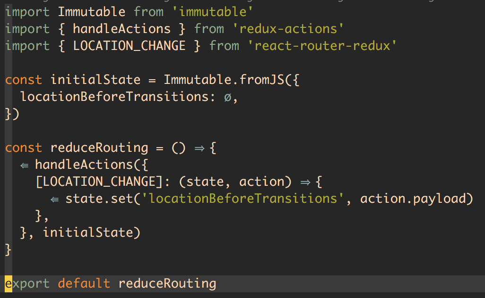

# 路由

前端项目往往依赖 react-router 作为标准的前端路由解决方案，react-router 封装了 history 进行页面状态管理，同时提供 react-router-redux 帮助收集路由信息到 reducer 中。

## 集成 Immutable

对于本例中的结构，要解决的问题只有如何转换 Immutable 的 state 数据结构，使 react-router-redux 提供的 `syncHistoryWithStore` 得以正常的工作。

参考 react-router-redux 官方提供的[集成方案](https://github.com/reactjs/react-router-redux#what-if-i-use-immutablejs-or-another-state-wrapper-with-my-redux-store)，本例使用 `selectLocationState` 的选项帮助我们访问 `historystate`。

然后调整相应在 reducer 内的 routing 结构即可。

